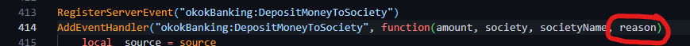
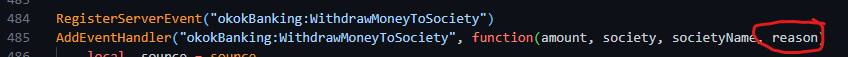
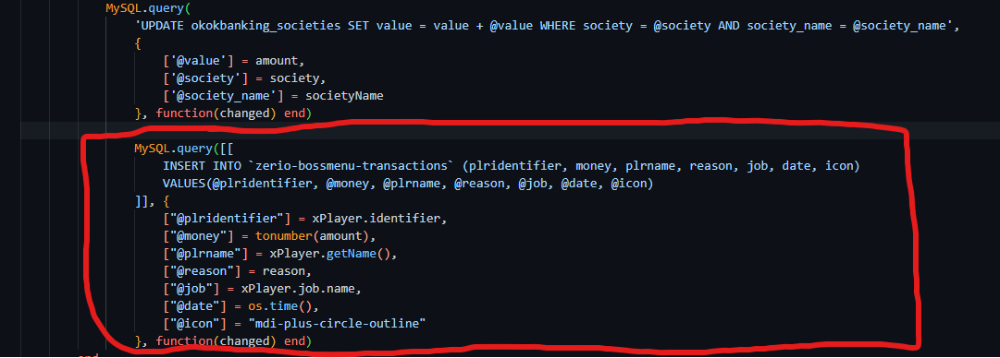
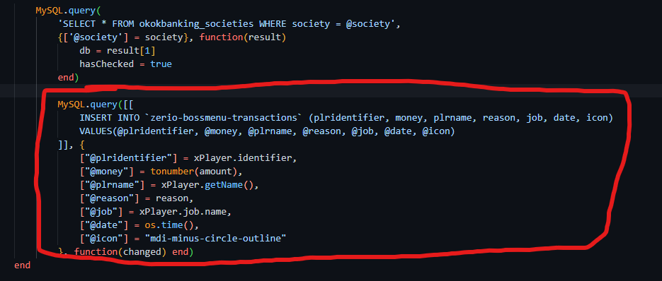
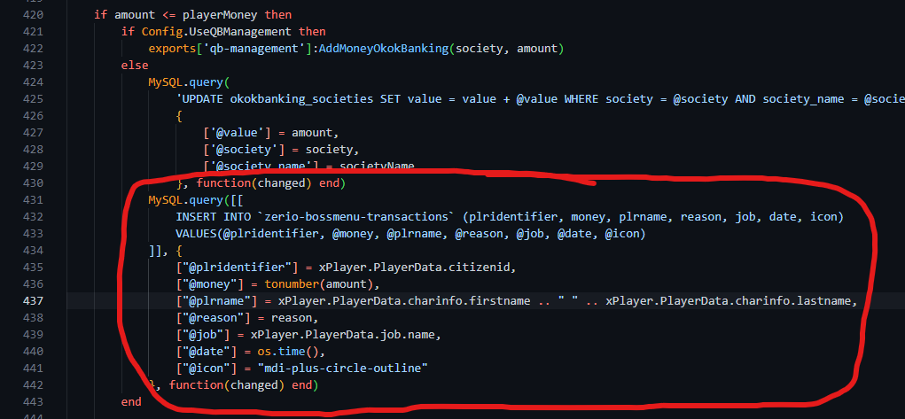
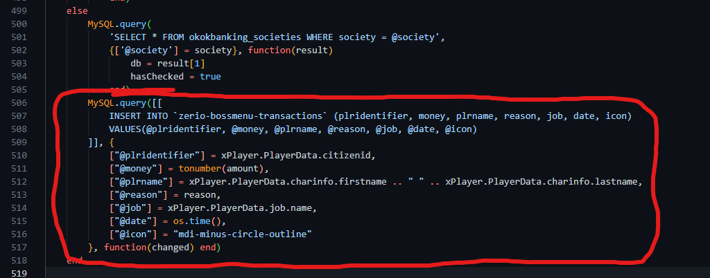

# Frequently asked questions

## Adding support for transaction history with okokBanking

Open okokBanking/server.lua and search for "okokBanking:DepositMoneyToSociety" to find the depositing event. Now add "reason" to the parameters list



Search for "okokBanking:WithdrawMoneyToSociety" in the same file and do the same with it.



(Make sure to remove the "societyMoney" parameter from the WithdrawMoneyToSociety event)

### ESX

In the "okokBanking:DepositMoneyToSociety" event, add these lines of code after the main mysql / updating part.

```lua
MySQL.query([[
	INSERT INTO `zerio-bossmenu-transactions` (plridentifier, money, plrname, reason, job, date, icon)
	VALUES(@plridentifier, @money, @plrname, @reason, @job, @date, @icon)
]], {
	["@plridentifier"] = xPlayer.identifier,
	["@money"] = tonumber(amount),
	["@plrname"] = xPlayer.getName(),
	["@reason"] = reason,
	["@job"] = xPlayer.job.name,
	["@date"] = os.time(),
	["@icon"] = "mdi-plus-circle-outline"
}, function(changed) end)
```



And in the "okokBanking:WithdrawMoneyToSociety" event, add these lines of code aswell.

```lua
MySQL.query([[
	INSERT INTO `zerio-bossmenu-transactions` (plridentifier, money, plrname, reason, job, date, icon)
	VALUES(@plridentifier, @money, @plrname, @reason, @job, @date, @icon)
]], {
	["@plridentifier"] = xPlayer.identifier,
	["@money"] = tonumber(amount),
	["@plrname"] = xPlayer.getName(),
	["@reason"] = reason,
	["@job"] = xPlayer.job.name,
	["@date"] = os.time(),
	["@icon"] = "mdi-minus-circle-outline"
}, function(changed) end)
```



### QB-Core

In the "okokBanking:DepositMoneyToSociety" event, add these lines of code after the main mysql / updating part.

```lua
MySQL.query([[
	INSERT INTO `zerio-bossmenu-transactions` (plridentifier, money, plrname, reason, job, date, icon)
	VALUES(@plridentifier, @money, @plrname, @reason, @job, @date, @icon)
]], {
	["@plridentifier"] = xPlayer.PlayerData.citizenid,
	["@money"] = tonumber(amount),
	["@plrname"] = xPlayer.PlayerData.charinfo.firstname .. " " .. xPlayer.PlayerData.charinfo.lastname,
	["@reason"] = reason,
	["@job"] = xPlayer.PlayerData.job.name,
	["@date"] = os.time(),
	["@icon"] = "mdi-plus-circle-outline"
}, function(changed) end)
```



And in the "okokBanking:WithdrawMoneyToSociety" event, add these lines of code aswell.

```lua
MySQL.query([[
	INSERT INTO `zerio-bossmenu-transactions` (plridentifier, money, plrname, reason, job, date, icon)
	VALUES(@plridentifier, @money, @plrname, @reason, @job, @date, @icon)
]], {
	["@plridentifier"] = xPlayer.PlayerData.citizenid,
	["@money"] = tonumber(amount),
	["@plrname"] = xPlayer.PlayerData.charinfo.firstname .. " " .. xPlayer.PlayerData.charinfo.lastname,
	["@reason"] = reason,
	["@job"] = xPlayer.PlayerData.job.name,
	["@date"] = os.time(),
	["@icon"] = "mdi-minus-circle-outline"
}, function(changed) end)
```


