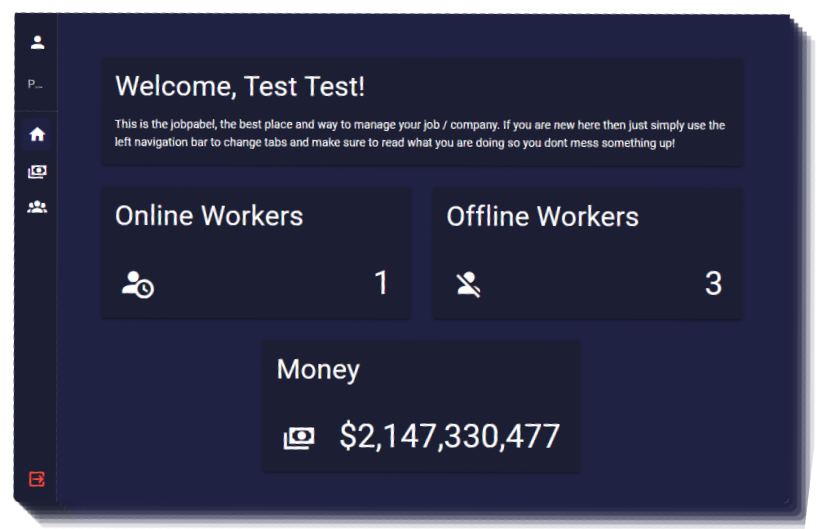

# Introduction

This is a modern and simple to use Bossmenu. It should contain everything you need in an bossmenu although additional features will be added in future updates.

**Features**

- Drag and drop installation
- Any society / money management script supported
- Modern UI
- Employee management
  - Hiring
  - Firing
  - Updating Ranks
- Money management
  - Withdrawal
  - Transaction history
  - Deposit
- Overview of the job
- Fully optimized

