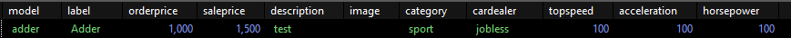
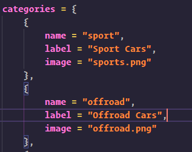

# Frequently asked questions

### How do I add new cars?

Adding new cars gets done through the database, and also through the ingame admin menu accessible through the /cardealeradmin command.

Example structure of a car in the database (zerio_cardealer-vehicles)



Please note that the "id" column should be left blank since it gets auto incremented.

### How do I add categories?

Categories get added through the config.lua file. Example category structure:

```lua
{
    name = "super"
    label = "menu name"
    image = "super.png"
}
```

And then simply add it to the categories list of any cardealer in your config.lua.<br/>
Add category images to the following directory: zerio-cardealer -> html -> images -> categories



### Adding Admins

Adding admins are done through adding their main identifier of the current character into the config of zerio-cardealer. The main identifier can be found in the database (users table, identifier value in es_extended | players table, license value in qb-core)
