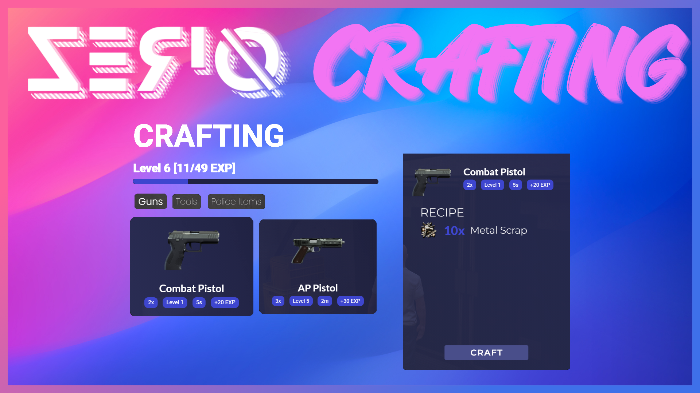

# Introduction

Have you ever wanted to take your crafting experience to the next level but only found mediocre crafting scripts? Look no further, this is an easy to understand and sleekly designed Crafting System for FiveM. It has all the features you would need for an awesome crafting experience on your server. It offers a large config to allow you to easily modify the script to your own liking.

## Features

- Large Config
- Locales / Translations
- Job authorization and gang authorization (QB-Core)
- Supports: BT-Target, QB-Target, QTarget, okokTextUi, QB-Core Text UI
- Custom success rate for different items
- Built in level and exp system
- All data gets saved, you dont have to worry about loosing items if you crash etc
- Built in awesome animations
- Fully optimized
- Lifetime support

