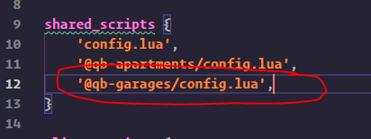

# Frequently asked questions

### Turning off the blip for a specific garage / impound

```lua
hideblip = true
```

Adding this simple line of code to a JobGarage, Impound or Garage will cause the blip to not be shown.

### Lock garage to specific vehicle types.

#### Valid vehicle types:

Compacts, Sedans, SUVs, Coupes, Muscle, SportClassic, Sport, Super, Motorcycle, Offroad, Industrial, Utility, Vans, Bicycles, Boats, Helicopter, Plane, Service, Emergency, Military

```lua
whitelistedTypes = {
    -- VEHICLE TYPES HERE
}
```

Adding this simple line of code to a Garage will lock it to the inputted vehicle types.

```lua
blacklistedTypes = {
    -- VEHICLE TYPES HERE
}
```

Adding this simple line of code to a Garage will lock it to all vehicle types except the inputted vehicle types.

### How do I setup housing support

Currently zerio-garage only supports qs-housing for house garages, if you wish for us to add support for any further scripts then please post an suggestion in our discord.

#### Opening an house garage menu

You can use the event below to open an house garage menu.

```lua
TriggerEvent("zerio-garage:client:OpenHousingGarage", houseId, "qs-housing")
```

houseId would be the actual house name / house id provided by your housing script, whilst "qs-housing" would be replaced with the name of the housing script that you are using

#### Putting back an vehicle at a house garage

You can use the event below to put back an vehicle at an house garage menu.

```lua
TriggerEvent("zerio-garage:client:PutBackHouseVehicle", houseId, "qs-housing")
```

houseId would be the actual house name / house id provided by your housing script, whilst "qs-housing" would be replaced with the name of the housing script that you are using

### How do I setup qb-phone support

Start by opening the fxmanifest.lua of qb-phone.\
Find the line that imports config.lua from qb-garages and delete it, the line should look somewhat like this.



Then add this at the bottom of the fxmanifest.lua file,

```lua
dependencies {
    "zerio-garage"
}
```

After removing it save the fxmanifest.lua file and instead open the server folder of qb-phone and then edit the main.lua file in the server folder. And add this line at the top of the server -> main.lua script.

```lua
Config.Garages = exports["zerio-garage"]:getQBPhoneData()
```
