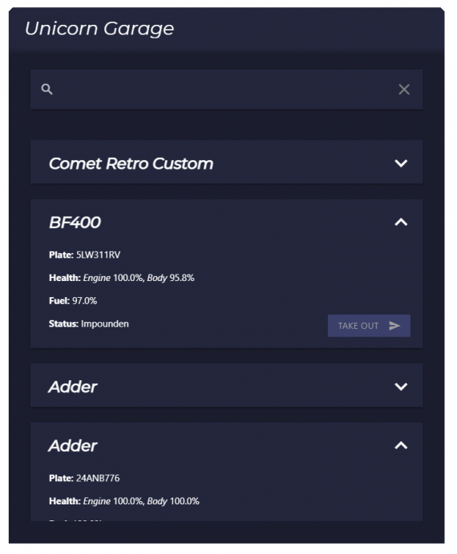

# Introduction

This is a modern garage script made for ESX and QB-Core. It's really easy to use and looks sleek + modern. Your players are definitely going to be satisfied with the nice UI and simple usage.

## Main Features

- Large Config
- Locales / Translations
- Themes
- Job Garages
- Impounds
- Normal Garages
- Saveable vehicle damage
- Animations
- Easy to setup

## Customizability

You can easily customize this script with the LARGE config, locales and alot more. 
For example, the javascript automatically updates to fit your locales, although the javascript is not obfuscated. 
You can also easily change "themes" by going into the css file and just changing the preset variables for i.e background colors etc.

