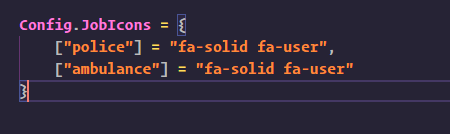

# Config

## Adding Icons

Adding icons can be done by changing Config.JobIcons, if an icon doesnt exist for a job it will automatically use Config.DefaultIcon instead!

## Links

[**List of icons**](https://fontawesome.com/)
