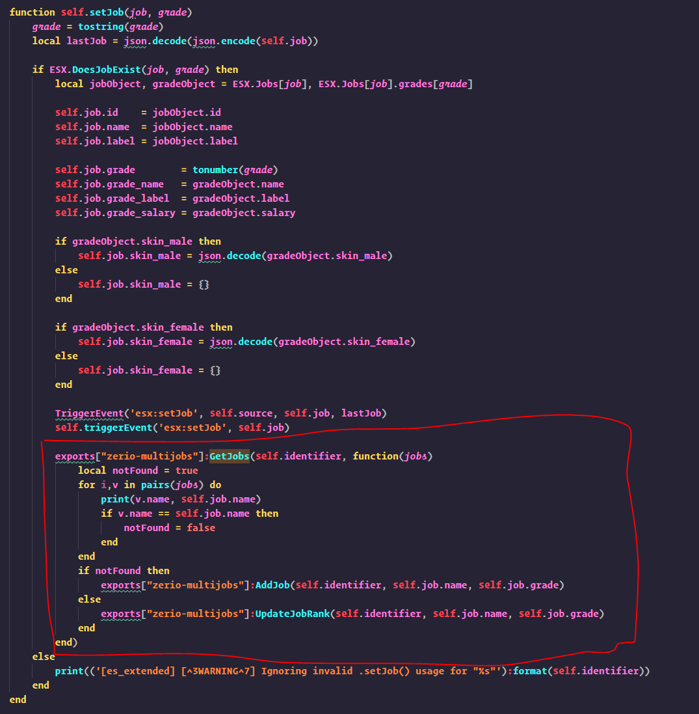
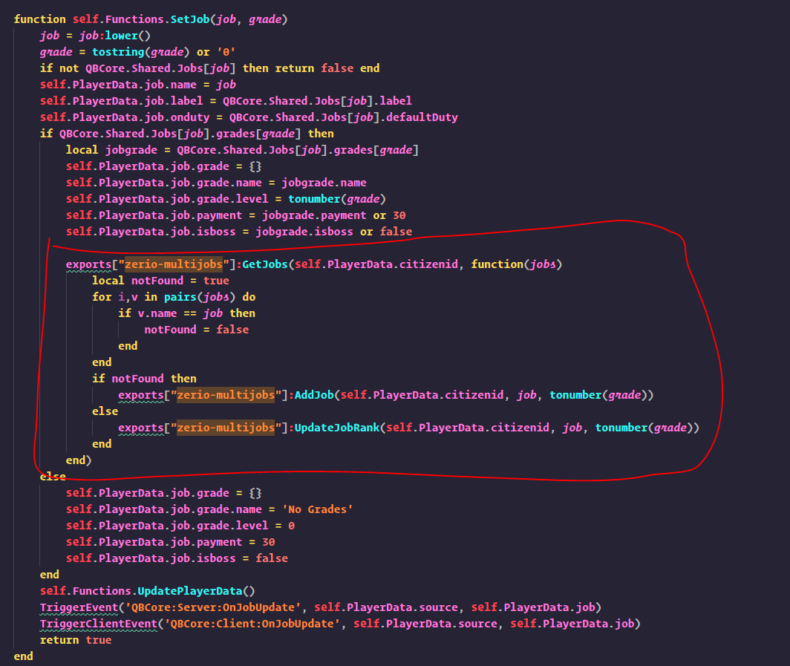

# Installation Guide

Installing this script is as easy as just downloading the script from the following [**website**](https://keymaster.fivem.net/)<br/>
After downloading the script you have to put it in your resources folder or a sub folder of the resources folder.<br/>
Lastly you will have to execute the SQL file to ensure that the script works with your server.

## Setup for SetJob function

Following the steps in this section will make all scripts that use the SetJob function in ESX / QB-Core automatically work with Zerio-Multijobs.

**ES_Extended:**

Open ES_Extended -> server -> classes -> player.lua and scroll down until you find the function called "self.setJob", in there you want to add this code after the "esx:setJob" event. (see image below)

<br/>



<br/>

```lua
exports["zerio-multijobs"]:GetJobs(self.identifier, function(jobs)
	local notFound = true
	for i,v in pairs(jobs) do
		if v.name == self.job.name then
			notFound = false
		end
	end
	if notFound then
		exports["zerio-multijobs"]:AddJob(self.identifier, self.job.name, self.job.grade)
	else
		exports["zerio-multijobs"]:UpdateJobRank(self.identifier, self.job.name, self.job.grade)
	end
end)
```

**QB-Core:**

Open QB-Core -> server -> player.lua and scroll down to the function called "self.Functions.SetJob", in there you want to add this code bit after the job updating part of the function (see image below)



```lua
exports["zerio-multijobs"]:GetJobs(self.PlayerData.citizenid, function(jobs)
    local notFound = true
    for i,v in pairs(jobs) do
        if v.name == job then
            notFound = false
        end
    end
    if notFound then
        exports["zerio-multijobs"]:AddJob(self.PlayerData.citizenid, job, tonumber(grade))
    else
        exports["zerio-multijobs"]:UpdateJobRank(self.PlayerData.citizenid, job, tonumber(grade))
    end
end)
```
