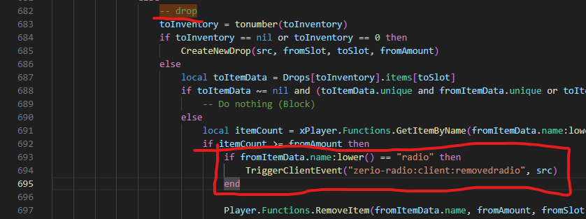
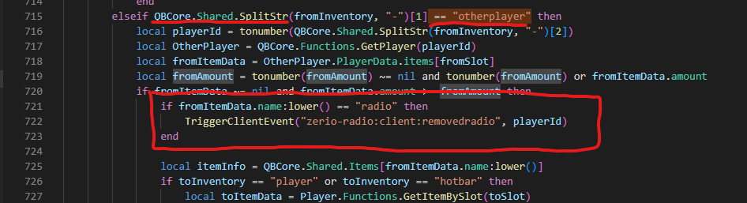
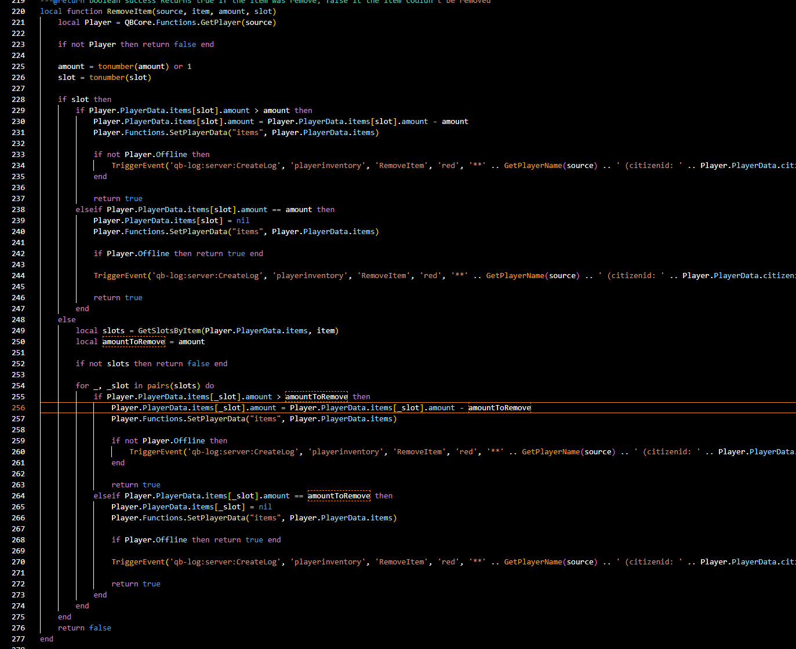
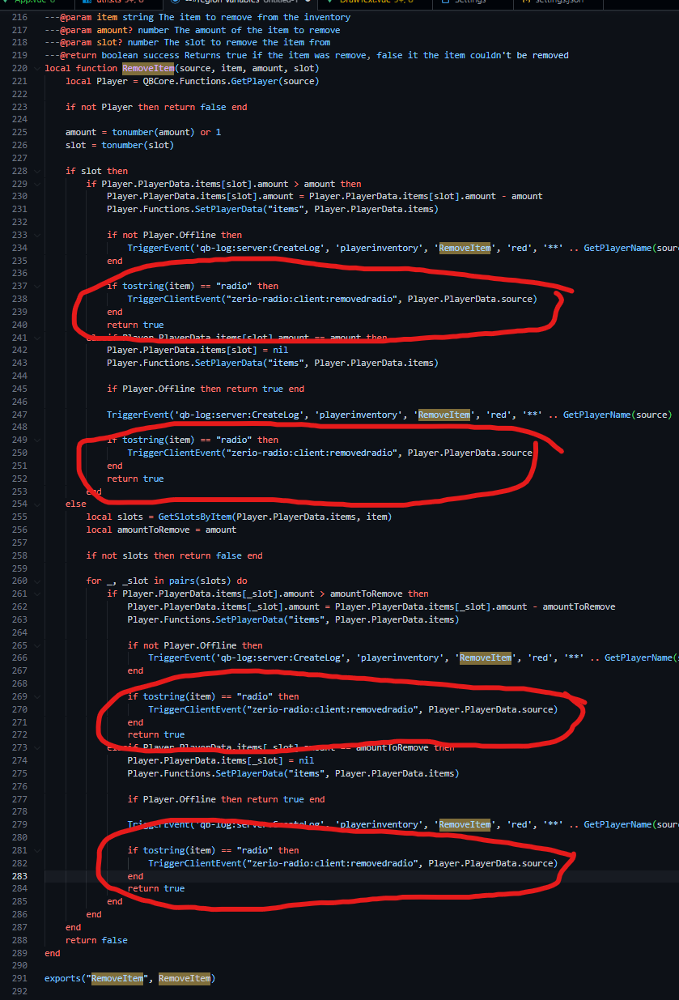
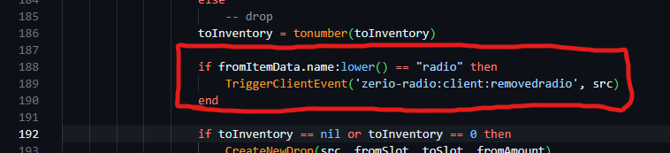
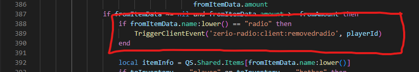
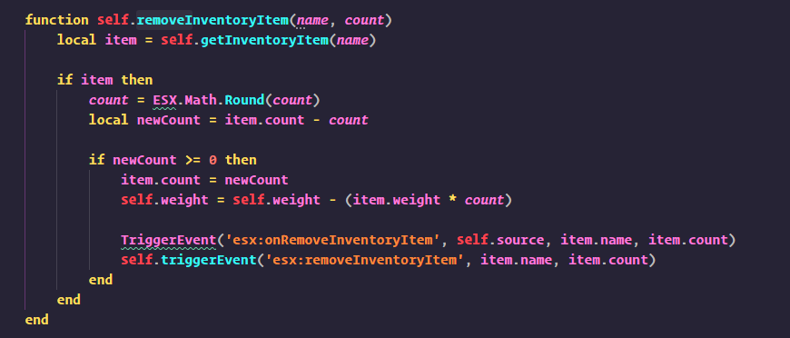
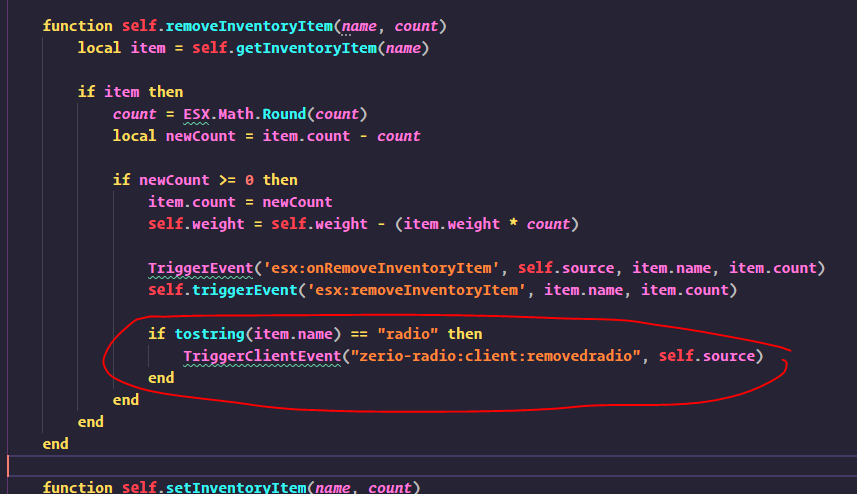

# Frequently asked questions

## Turn off radio on drop

To do this you will have to add a piece of code to your remove item function of either es_extended or qb-core.

### QB-Core

#### Quasar Inventory

##### Dropping

This is quite simple, open this file in any text editor. qs-inventory -> config -> config_setInventory.lua. After that, find the drop part of the function, which should be shown by an print saying: `-- drop`:



We want to add the following code in the beginning of the function.

```lua
if fromItemData.name:lower() == "radio" then
    TriggerClientEvent("zerio-radio:client:removedradio", src)
end
```

##### Robbing

This is quite simple, open this file in any text editor. qs-inventory -> config -> config_setInventory.lua. After that, find the drop part of the function, which should be shown by an if statement mentioning: `== "otherplayer"`:



We want to add the following code in the beginning of the function.

```lua
if fromItemData.name:lower() == "radio" then
    TriggerClientEvent("zerio-radio:client:removedradio", src)
end
```

#### Other

This is quite simple, open this file in any text editor. qb-inventory -> server -> main.lua. After that, find the function called "RemoveItem" The function should look close to this:<br/>

<br/>

We want to add this piece of code over all of the "return true". (There are other ways although I dont want to over complicate this)

```lua
if tostring(item) == "radio" then
    TriggerClientEvent("zerio-radio:client:removedradio", Player.PlayerData.source)
end
```

Example of how it would look after the change:<br/>



### ESX / es_extended

#### Quasar Inventory

##### Dropping

This is quite simple, open this file in any text editor. qs-inventory -> config -> config_setInventory.lua. After that, find the drop part of the function, which should be shown by an print saying: `-- drop`:



We want to add the following code in the beginning of the function.

```lua
if fromItemData.name:lower() == "radio" then
    TriggerClientEvent("zerio-radio:client:removedradio", src)
end
```

##### Robbing

This is quite simple, open this file in any text editor. qs-inventory -> config -> config_setInventory.lua. After that, find the drop part of the function, which should be shown by an if statement mentioning: `== "otherplayer"`:



We want to add the following code in the beginning of the function.

```lua
if fromItemData.name:lower() == "radio" then
    TriggerClientEvent("zerio-radio:client:removedradio", src)
end
```

#### Other

This is quite simple, open this file in any text editor. es_extended -> server -> classes -> player.lua. After that, find the function called "removeInventoryItem" The function should look around the same as this, if it doesnt then dont worry. You most likely just have an different es_extended version:



We want to add this piece of code after the "TriggerEvent(s)".

```lua
if tostring(item.name) == "radio" then
    TriggerClientEvent("zerio-radio:client:removedradio", self.source)
end
```

Example of how it would look after the change:


