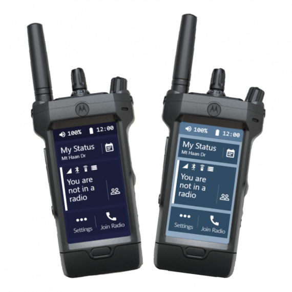

# Introduction

This is a very simple and easy to use Radio script. It is nothing like the other radios in FiveM and has alot more features then most other radios.

This script supports nearly all frameworks (including standalone) and nearly all popular voice scripts. This Radio has all features you would want and it is perfect for both civil people, criminals and also as a police radio etc.

## Main Features

- Drag and drop installation
- Realistic
- Sounds & Animations
- Sleek & Modern UI
- Customizable
- Themes
- Lifetime support
- Frequencies locked for jobs
- Radio Scanner
- The possibility to either control the UI with your mouse, or via your keyboard (without nui focus)
- Channel system, you can favorite channels and view your channel history
- Callsign support, support for custom callsigns
- A neat custom prop, included for free
- Messaging system, to stay updated with your friends/colleagues
- Panic Alarm
- "No talk over mode" for pma-voice

... and much more

## Requirements

This script requires some sort of voice script (PMA-Voice, TokoVoip, Saltychat and Mumble-VOIP is supported by default).

It would also require some sort of sql database running, the currently supported wrapper resources are oxmysql, mysql-async and ghmattimysql

## Support / Help

When buying any product from Zerio-Scripts, you can always obtain any sort of support in our discord server. 
It can range from reporting errors / bugs to even help setting up the script. We will make sure that you are satisfied with your purchase!
This does not include support for heavily changed frameworks, custom frameworks or anything that we have not said we will be supporting

