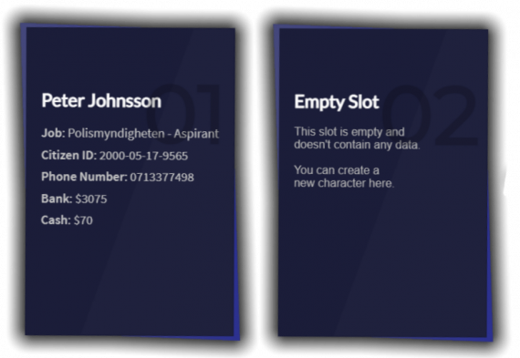

# Introduction

This is a clean and easy to use multi character script, which allows players to create an set amount of characters divided over a set amount of pages. Everything you need is included so you can set this script up by simply dragging and dropping it into your server.\

#### Main Features 

* Drag and drop installation
* Sleek & Modern UI
* Sign Up, Delete & Spawn UI
* Customizeable
* Themes
* Lifetime support

#### Customizability 

You can easily customize this script with the LARGE config, locales and alot more.\
You can also easily change "themes" by going into the css file and just changing the preset variables for i.e background colors etc.

