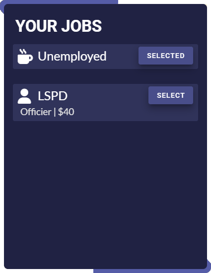

# Introduction

This is a stylish, modern and good looking multi jobs system.\
Its easy to use / setup and provides great examples of how to use it both for people that dont want to make custom stuff but also for people that are interested in changing / making custom work for it.

#### Main Features 

* Large Config
* Locales / Translations
* Themes
* Context Menu
* Animations
* Lifetime support
* Custom script integration for developers

#### Customizability 

You can easily customize this script with the large config, locales and alot more.\
None of the Javascript, HTML or CSS is obfuscated or locked in any way although the main LUA functions are locked to ensure that the script doesnt get leaked, you are still able to change alot through a functions file for LUA.

